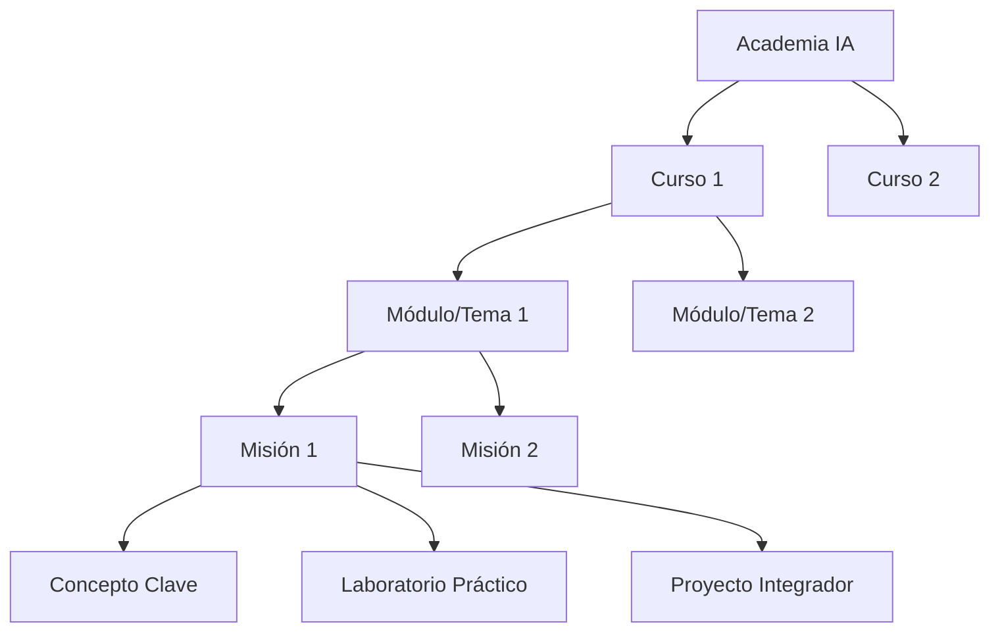

# ORÁCULO IA — Academia de Inteligencia Artificial v1.0

Este documento detalla la estructura, el catálogo de cursos y la planificación curricular offline de **Academia IA v1.0** para ORÁCULO IA.

---

## 🏛️ Estructura Curricular

La Academia organiza el conocimiento jerárquicamente de la siguiente forma:

---

## 📚 Catálogo de Cursos (Módulo 1)

Contamos inicialmente con 10 cursos organizados en categorías y niveles de dificultad:

1. **Fundamentos de IA** (Fundacionales · Inicial): Conceptos esenciales de Inteligencia Artificial para no-técnicos.
2. **Prompt Engineering Avanzado** (Prompt Engineering · Intermedio): Técnicas complejas de instrucción y estructuración de prompts.
3. **Modelos LLM y Arquitecturas** (Fundacionales · Intermedio): Funcionamiento interno, embeddings, parámetros y fine-tuning.
4. **Sistemas de Agentes de IA** (Automatización · Avanzado): Agentes autónomos offline dotados de memoria y herramientas.
5. **Automatización con Workflows** (Automatización · Avanzado): Orquestación de flujos lógicos con modelos de lenguaje y APIs.
6. **IA para Productividad Personal** (Productividad · Inicial): Optimización de redacción, síntesis y organización diaria.
7. **IA para Excel y Datos** (Productividad · Inicial): Limpieza, fórmulas complejas y predicciones en hojas de cálculo.
8. **IA para Programación** (Desarrollo · Intermedio): Uso de copilotos de código, refactorización y testing automatizado.
9. **IA para Empresas** (Productividad · Intermedio): Estrategias de adopción corporativa, compliance y retorno de inversión.
10. **IA en el Sector Bancario** (Productividad · Avanzado): Auditoría, mitigación de riesgos y detección de fraude financiero.

---

## 🗺️ Planificación de las 100 Misiones (Módulo 2)

Las 100 misiones se definen en el archivo offline `knowledge/academy_missions_v1.json`. Cada misión contiene:
* **ID:** Código secuencial único (`ac-001` a `ac-100`).
* **Título y Objetivo:** Metas observables de desempeño didáctico.
* **Duración estimada:** Inversión de tiempo promedio de estudio en minutos.
* **Prerrequisitos:** Dependencias lógicas a nivel de lección previa.
* **Conceptos:** Conceptos clave que desarrolla el estudiante al completarla.
* **Dificultad:** Inicial, Intermedio o Avanzado.

---

## 🔍 Explorador y Buscador General (Módulos 3 y 6)
* **Explorador:** Permite filtrar interactivamente por curso y nivel de dificultad, mostrando a detalle qué conceptos, laboratorios y proyectos integradores están vinculados a cada misión.
* **Buscador Multientidad:** Indexa de manera instantánea y simultánea los 10 cursos, las 100 misiones, los artículos del manual offline, los términos del glosario técnico, los laboratorios interactivos y la biblioteca de pensamiento.
