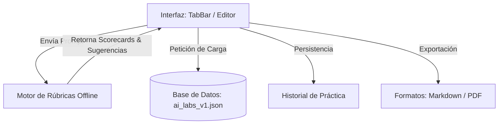

# ORÁCULO IA — AI Lab v1.0

Este documento detalla la arquitectura, el flujo de evaluación y la estructura offline de **ORÁCULO AI LAB v1.0**.

---

## 🏛️ Arquitectura del AI Lab

El Laboratorio de IA está diseñado como un entorno de experimentación offline compuesto por tres capas:

* **knowledge/ai_labs_v1.json:** Catálogo de 50 laboratorios estructurados y categorizados que definen objetivos, pasos, resultados esperados y errores frecuentes.
* **AiLabRepository:** Gestiona en memoria las plantillas preestablecidas y el historial de sesiones.
* **Evaluador de Prompts:** Algoritmo offline basado en reglas que analiza sintáctica y semánticamente el prompt ingresado.

---

## 📊 Rúbrica de Evaluación Estructural (Módulo 5)

La evaluación local califica 5 pilares de 0 a 100 puntos basándose en reglas heurísticas:

1. **Claridad y Acción:** Evalúa la presencia de verbos imperativos (e.g., *resumí*, *creá*, *analizá*) y la longitud del prompt.
2. **Contexto y Rol:** Califica la asignación de roles o antecedentes mediante palabras clave (e.g., *rol*, *actúa como*, *experto*).
3. **Restricciones y Límites:** Detecta la delimitación de exclusiones o límites cuantitativos (e.g., *evitá*, *nunca*, *máximo 5 palabras*).
4. **Formato de Salida:** Comprueba si se detalla la estructura visual (e.g., *tabla markdown*, *JSON*, *lista*).
5. **Meta y Objetivo:** Analiza si se explicita el propósito de la consulta (*para*, *con el fin de*).

---

## 📂 Plantillas Preestablecidas (Módulo 6)

Disponemos de 10 plantillas listas para usar que cubren:
* **Resumir Ejecutivo:** Condensar informes extensos.
* **Investigar Concepto:** Planificación didáctica de temas nuevos.
* **Traducción Técnica:** Traducción estructurada respetando un glosario.
* **Programación Robusta:** Crear funciones con control de errores.
* **Analizar PDFs:** Extracción cuantitativa estructurada.
* **Generar Tablas:** Tabulación de datos sucios.
* **Fórmulas Excel:** Condicionales complejos.
* **Automatización y APIs:** Esquemas JSON y límites de tasa.
* **Minutas y Acuerdos:** Compilar actas de reuniones.
* **Brainstorming Estructurado:** Lluvia de ideas analítica por riesgo y ROI.

---

## 📥 Historial y Exportación (Módulos 8 y 9)
* **Historial:** Guarda de forma local y persistente el laboratorio, fecha de ejecución, puntuación alcanzada, observaciones, prompt original/mejorado y aprendizajes.
* **Exportación:** Permite generar reportes estructurados en Markdown listos para ser pegados en cualquier editor o simular la exportación a archivos PDF.
