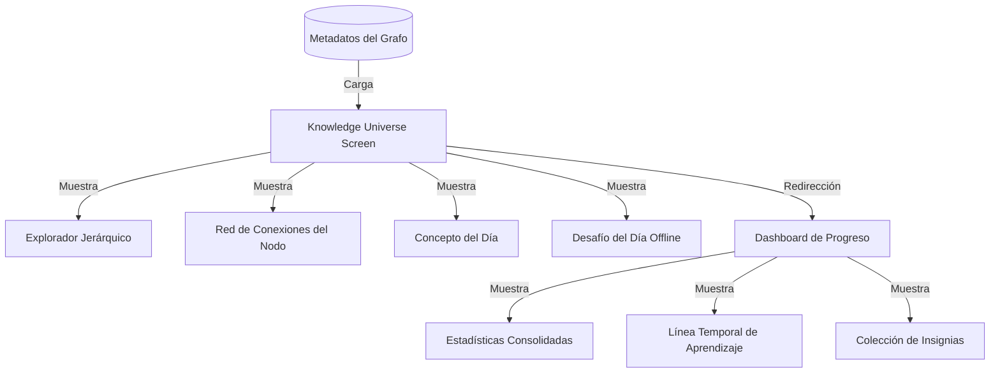

# ORÁCULO IA — Knowledge Universe v1.0

Este documento detalla la arquitectura, relaciones conceptuales, lógica de gamificación educativa y diseño técnico del **Knowledge Universe** en ORÁCULO IA.

---

## 🏛️ Filosofía de Diseño

El **Knowledge Universe** rompe con el paradigma de la educación lineal. En lugar de forzar al alumno a seguir un temario secuencial rígido, la aplicación presenta el conocimiento como una red interconectada (Grafo de Conocimiento) que promueve la exploración autónoma y el aprendizaje basado en descubrimientos.

---

## 🔗 Red de Conexiones (Módulo 2)

Cada concepto en la red es un nodo inteligente que calcula en tiempo real sus dependencias:
* **¿Qué lo explica en el Manual?:** Artículos del manual teórico que cubren la definición conceptual básica.
* **¿Qué depende de él?:** Misiones avanzadas que requieren dominar este nodo para ser desbloqueadas.
* **¿Qué laboratorios lo practican?:** Ejercicios de optimización de prompts del AI Lab que lo ejercitan.
* **¿Qué proyectos lo utilizan?:** Entregables prácticos obligatorios donde el concepto es central.
* **¿Qué misiones lo enseñan?:** Las lecciones y quizzes que introducen y aumentan el nivel cognitivo de este concepto.

---

## 🧭 Explorador Jerárquico Secuencial (Módulo 3)

Para alumnos que prefieren una guía estructurada, el Explorador Secuencial despliega un camino sugerido de aprendizaje de IA:
`LLM` ➔ `Transformer` ➔ `Attention` ➔ `Embeddings` ➔ `RAG` ➔ `Agentes`

Tapar cualquier nodo actualiza instantáneamente el mapa de relaciones, permitiendo profundizar en la sub-red del concepto.

---

## 🏆 Insignias de Maestría y Gamificación Educativa (Módulo 7)

ORÁCULO IA evita los puntos de experiencia (XP) genéricos, que incentivan la repetición mecánica. En su lugar, el sistema adjudica **Insignias de Maestría** basadas en hitos didácticos reales:

1. **Iniciando el Viaje:** Otorgado al lograr comprender el primer concepto en nivel >= 2.
2. **Arquitecto de Prompts:** Otorgado al alcanzar nivel 4 (Dominado) en el concepto central de *Prompt*.
3. **Entregable de Plata:** Otorgado al finalizar y entregar satisfactoriamente el primer proyecto integrador.
4. **Científico del Lab:** Otorgado al realizar al menos 3 iteraciones/prácticas en el AI Lab.
5. **Constancia de Hierro:** Otorgado al registrar más de 5 horas reales de estudio.

---

## 📈 Dashboard y Línea Temporal (Módulos 6 y 8)
* **Línea Temporal (Timeline):** Registra cronológicamente la historia de estudio del alumno, guardando fechas y descripciones exactas de cuándo se aprendió o repasó cada concepto y cuándo se finalizaron laboratorios o proyectos.
* **Dashboard Consolidado:** Agrupa horas totales de estudio, total de fallas registradas, repasos completados, entregas de proyectos, recuento de nodos del universo y estado de la meta semanal.
