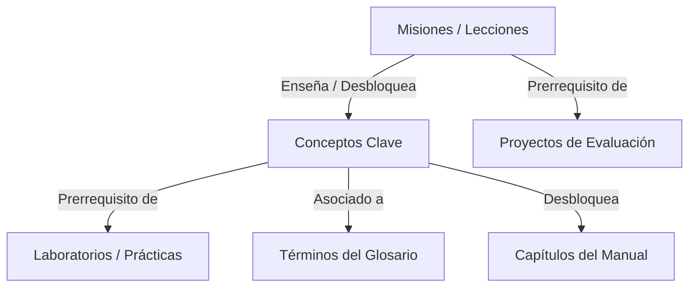

# ORÁCULO Learning Engine v2

ORÁCULO Learning Engine v2 es el motor de aprendizaje no lineal basado en grafos de ORÁCULO IA. Su objetivo principal es asegurar una experiencia didáctica adaptativa y offline, donde el avance del estudiante se guíe por su nivel de dominio conceptual y metas de estudio reales, en lugar de una lista fija lineal de misiones.

---

## 🏗️ Arquitectura Basada en Grafos (Módulo 1)

El motor unifica todas las entidades del sistema en un grafo de relaciones dirigidas:

Cada nodo del grafo (`KnowledgeGraphNode`) conoce:
* **Tipo:** misión, concepto, laboratorio, proyecto, término, capítulo.
* **Prerrequisitos:** nodos críticos previos que deben ser completados o comprendidos.
* **Desbloqueos:** nodos que quedan habilitados al completar este nodo.
* **Dependencias:** relaciones contextuales no bloqueantes.
* **Dificultad e Inversión de Tiempo:** estimaciones didácticas en minutos.

---

## ⚙️ Reglas Pedagógicas del Motor

### 1. Sistema de Prerrequisitos Críticos (Módulo 2)
* Ninguna misión o laboratorio se desbloquea a menos que todos sus prerrequisitos conceptuales y de lecciones anteriores estén satisfechos.
* El motor reporta con precisión qué prerrequisito falta completar para facilitar la transparencia.

### 2. Dominio Conceptual en Niveles 0 a 5 (Módulo 3)
El progreso de estudio se mide de manera granular por concepto:
* **0 - No visto:** El concepto no ha aparecido en el recorrido.
* **1 - Leído:** Se presentó la definición básica.
* **2 - Comprendido:** Aprobó preguntas teóricas del concepto (Prerrequisito mínimo de desbloqueo).
* **3 - Aplicado:** Completó laboratorios prácticos asociados al concepto.
* **4 - Dominado:** Resolvió de forma excelente retos y proyectos relacionados.
* **5 - Enseñado:** Capacidad demostrada en el CMS u otras interacciones avanzadas.

### 3. Rutas Dinámicas Personalizadas (Módulo 4)
El algoritmo de recomendación genera la ruta de estudio diaria basándose en:
* Tiempo disponible (e.g. 15 minutos o 1 hora).
* Objetivos elegidos por el alumno ("Aprender Prompt Engineering").
* Estado de detenciones o proyectos de track activos.

### 4. Transferencia Didáctica (Módulo 5)
* Al ingresar a una lección que vuelve a citar un concepto previamente dominado (nivel >= 2), el motor adapta las explicaciones didácticas de forma inteligente. En lugar de repetir la teoría básica, enlaza el contenido nuevo de forma acumulativa ("Dado que ya comprendiste X...").

### 5. Detención Inteligente por Fallas Consecutivas (Módulo 6)
* Si el alumno registra tres o más errores consecutivos en cuestionarios de evaluación, el motor de aprendizaje detiene automáticamente el avance de misiones principales, obligándole a realizar repasos del manual y laboratorios prácticos de menor nivel hasta restablecer el contador de errores.

### 6. Proyectos Integradores de Track Bloqueantes (Módulo 7)
* Para avanzar de un track formativo a otro (por ejemplo, avanzar al track de automatización), es estrictamente necesario culminar y entregar el proyecto integrador correspondiente.

---

## 📊 Árbol del Conocimiento y Métricas Reales (Módulos 8 y 9)
La vista `KnowledgeMapScreen` ofrece:
* **Visualización del Árbol de Conocimiento:** Identificación visual de ramas de misiones, laboratorios, proyectos y su estado actual (Bloqueado/Desbloqueado).
* **Indicadores de Dominio:** Muestra el nivel cognitivo actual de cada concepto.
* **Metas Reales de Estudio:** Panel consolidado de métricas (horas reales estudiadas, total de errores acumulados, proyectos completados y promedios).
