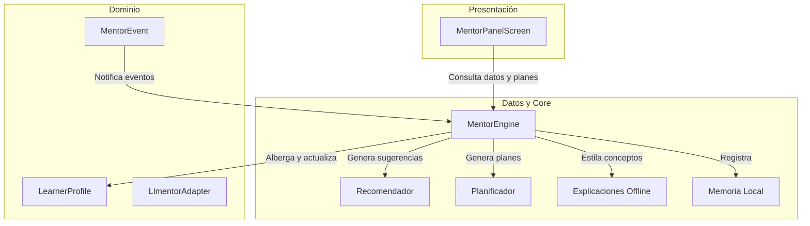

# ORÁCULO Mentor Engine v1.0

ORÁCULO Mentor Engine es el motor de tutoría pedagógica inteligente, diseñado bajo una arquitectura offline y adaptativa para guiar de forma estructurada el aprendizaje del usuario durante meses.

---

## 🏗️ Arquitectura General

El motor está estructurado de manera desacoplada en módulos de lógica pedagógica, persistencia de memoria local, y contratos de integración para modelos de lenguaje externos.

---

## 🛠️ Módulos del Motor

### 1. Perfil Pedagógico (Módulo 1)
El modelo `LearnerProfile` registra:
* **Métricas de progreso:** Horas totales dedicadas al estudio y velocidad estimada de aprendizaje.
* **Estado cognitivo:** Conceptos completamente aprendidos/dominados y conceptos pendientes por cursar.
* **Patrón de errores:** Mapa de fallos acumulados por concepto y tipo de error.
* **Historial evaluativo:** Registro histórico de calificaciones de quizzes y revisiones.

### 2. Motor de Recomendaciones (Módulo 2)
Implementado bajo reglas deterministas locales para sugerir el siguiente paso:
1. **Prioridad de Repaso:** Si un concepto acumula dos o más fallos frecuentes, se sugiere prioritariamente repasar dicho tema.
2. **Prioridad de Proyectos:** Si hay proyectos prácticos marcados como activos, se sugiere avanzar en ellos para consolidar la teoría.
3. **Misiones Nuevas:** Si no hay bloqueos de repaso ni proyectos, se recomienda la siguiente lección basada en el orden de conceptos pendientes del perfil.
* *Nota:* Cada recomendación se entrega con una justificación clara redactada en español explicando la razón didáctica.

### 3. Explicaciones Alternativas (Módulo 3)
La infraestructura está diseñada para responder con explicaciones en 7 tonos diferentes según el estilo preferido del estudiante:
* **Formal:** Definiciones técnicas académicas.
* **Simple:** Explicaciones llanas y conversacionales.
* **Ejemplo Cotidiano:** Casos prácticos del día a día.
* **Ejemplo Técnico:** System prompts, llamadas a APIs o flujos de código concretos.
* **Analogía:** Relaciones metafóricas para visualización abstracta.
* **Paso a Paso:** Secuencias enumeradas de aplicación.
* **Resumen Ejecutivo:** Conclusiones orientadas al valor y la producción.

### 4. Dificultad Adaptativa (Módulo 4)
* Incrementa automáticamente la dificultad general del perfil (`Inicial` -> `Intermedio` -> `Exigente`) ante respuestas correctas consistentes o finalización exitosa de evaluaciones.
* Reduce la dificultad y aumenta el número de ejemplos prácticos o repeticiones de laboratorios si se registran errores continuos sobre los mismos temas.

### 5. Memoria de Interacciones (Módulo 5)
* Registra los conceptos que ya han sido explicados, las analogías usadas, los laboratorios completados y las recomendaciones aceptadas por el alumno para evitar repeticiones.

### 6. Planificador de Sesiones (Módulo 6)
* Genera planes a medida combinando tiempos disponibles (e.g. 15 minutos o 1 hora) y objetivos específicos elegidos por el usuario ("Aprender Prompt Engineering", "Construir Agentes"), estructurando rutas de estudio cortas o extensivas al instante.

### 7. Adaptadores LLM Comerciales (Módulo 7)
La interfaz `LlmentorAdapter` desacopla al cliente de las APIs externas de Inteligencia Artificial utilizando el patrón Adapter. Proporciona implementaciones listas para:
* **Gemini (Google)**
* **OpenAI**
* **Claude (Anthropic)**
* **DeepSeek**
* **Qwen**
* **GLM (Zhipu)**
* **Llama (Meta)**
* **Mistral**

---

## 📊 Panel del Mentor (Interfaz de Usuario)
La pantalla `MentorPanelScreen` permite al usuario:
* Visualizar el progreso general y la dificultad actual adaptada.
* Comprobar la recomendación personalizada del día y aceptarla.
* Utilizar el planificador interactivo especificando su tiempo disponible y objetivo.
* Simular e inspeccionar los prompts generados por los adaptadores de IA para verificar su comportamiento antes de su integración comercial futura.
